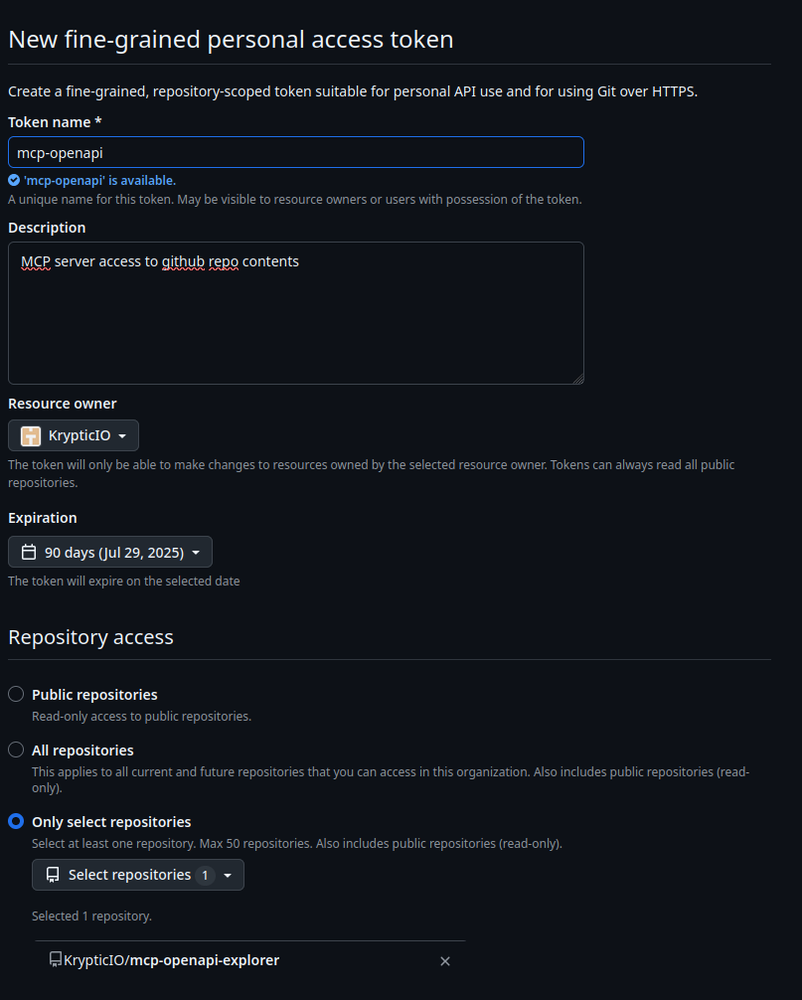
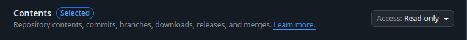

# MCP OpenAPI Explorer

A Model Context Protocol (MCP) server that analyzes OpenAPI specifications and provides context about interacting with APIs.

## Features

- Load OpenAPI specifications from various sources (GitHub, local files, HTTP URLs)
- Parse and provide comprehensive context about API endpoints
- Support for the Model Context Protocol (MCP) via stdin/stdout
- Provide intelligent context about API interactions to LLMs
- Support for both JSON and YAML OpenAPI specifications
- Built with Cobra CLI for easy command-line usage
- Structured logging with Zap

## Getting Started

### Prerequisites

- Go 1.24.2 or later
- Docker (optional)

### Installation

1. Clone the repository:
```bash
git clone https://github.com/krypticlabs/mcp-openapi-explorer.git
cd mcp-openapi-explorer
```

2. Install dependencies:
```bash
go mod download
```

3. Build:
```bash
go build
```

### Configuration

MCP OpenAPI Explorer can be configured using a YAML configuration file. You can export a default configuration file using:

```bash
./mcp-openapi-explorer config export config.yaml
```

Then, modify the configuration file to suit your needs and run the server with:

```bash
./mcp-openapi-explorer --config config.yaml serve
```

### Creating a GitHub Token

If you need to access private GitHub repositories or want to avoid rate limits when loading OpenAPI specs from GitHub, you'll need a GitHub token:

1. Go to [GitHub Settings](https://github.com/settings/profile)
2. Select **Developer settings** from the left sidebar
3. Select **Personal access tokens** → **Fine-grained tokens**
4. Click **Generate new token** → **Generate new token**
5. Give your token a descriptive name and description
   
6. Repository access: **only select repositories**
   - then select the repositories you want to give this PAT access to
7. Permissions:
   - The only permission this needs is the **contents** permission and **read-only** access
     
8. Click **Generate token**
9. Copy the token (you won't be able to see it again!)

Add this token to your configuration file or provide it via the environment variable `MCP_OPENAPI_GITHUB_TOKEN`.

### Configuring MCP Clients

You can integrate MCP OpenAPI Explorer with MCP clients by adding it to your MCP client configuration. This allows the client to automatically start and communicate with the MCP server.

#### Download the Binary

Download the appropriate binary for your platform from the [GitHub Releases](https://github.com/krypticlabs/mcp-openapi-explorer/releases) page.

#### MCP Client Configuration

Add the MCP OpenAPI Explorer to your MCP client configuration file (typically `~/.mcp/config.json` or similar):

```json
{
  "mcpServers": {
    "openapi-explorer": {
      "command": "/path/to/mcp-openapi-explorer",
      "args": ["serve", "--config", "~/.mcp-openapi.yaml"]
    }
  }
}
```

Replace `/path/to/mcp-openapi-explorer` with the actual path to the binary on your system. The `environment` section is optional and can be used to set environment variables for the MCP server.

## MCP Usage

The MCP server operates via stdin/stdout, which is the preferred approach for integrating with LLMs. This avoids networking complexities and works well with various LLM integrations.

### Start the server

```bash
./mcp-openapi-explorer serve
```

Options:
- `-v, --verbose` - Enable verbose output
- `-c, --config string` - Path to configuration file

### GitHub Repository Support

You can load OpenAPI specifications directly from GitHub repositories, including private ones with a token:

```yaml
specs:
  - "@github.com/yourOrg/yourRepo/blob/main/pathToSpec.json|yaml"
```

## Available MCP Tools

The MCP server exposes the following tools:

### `get_api_info`

Get comprehensive information about API endpoints from loaded OpenAPI specifications.

**Parameters:**
- `query` (string, required): Query about API endpoints (e.g. 'How do I create a new user?', 'What endpoints are available for pet management?')

### `load_api_spec`

Load an OpenAPI specification from a URL or file path.

**Parameters:**
- `url` (string, required): URL or file path to the OpenAPI spec. Supports:
  - HTTP/HTTPS URLs (e.g., 'https://petstore3.swagger.io/api/v3/openapi.json')
  - GitHub URLs with '@' prefix (e.g., '@github.com/org/repo/blob/main/api.yaml')
  - Local file paths (e.g., 'file:///path/to/spec.json' or just '/path/to/spec.json')
  - Both JSON and YAML formats are supported

### `list_api_specs`

List all loaded OpenAPI specifications.

## How It Works

1. Users load OpenAPI specifications into the server (configured in the config file)
2. The server parses and stores these specifications (supporting both JSON and YAML formats)
3. When a user asks about an API endpoint, the server provides comprehensive context about all available endpoints
4. The LLM uses this context to answer user queries accurately

## Docker

```bash
docker build -t mcp-openapi-explorer .

# Run the server with input from stdin
docker run -i mcp-openapi-explorer serve < your-jsonrpc-request.json

# Run the server with a configuration file
docker run -i -v $(pwd)/config.yaml:/app/config.yaml mcp-openapi-explorer --config /app/config.yaml serve
```

## License

MIT 